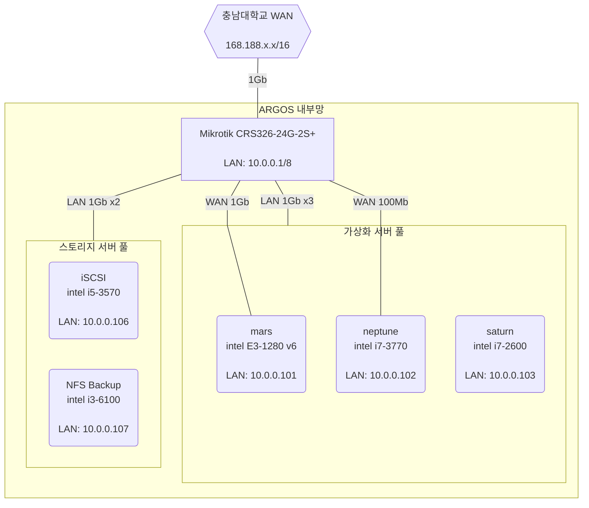
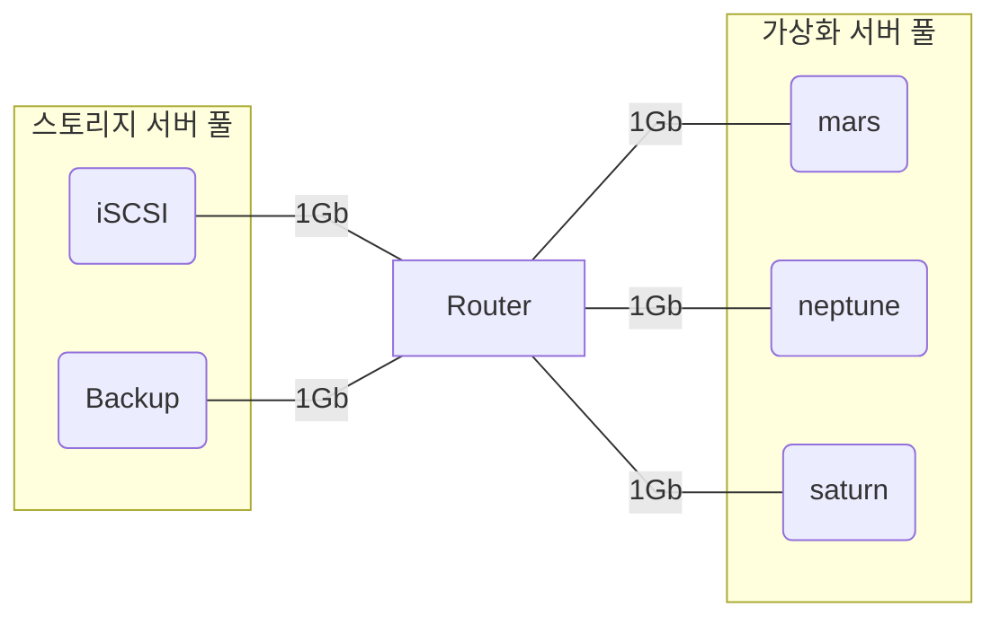
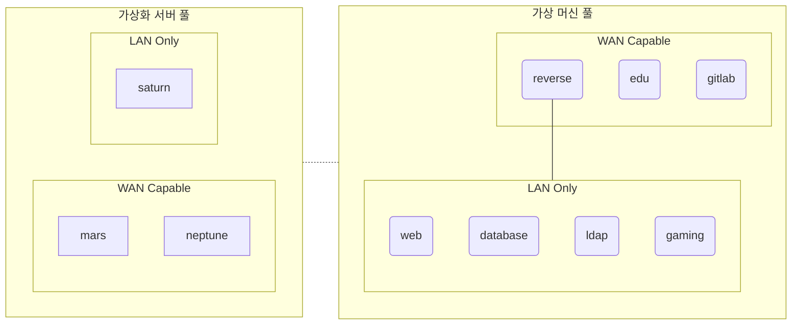
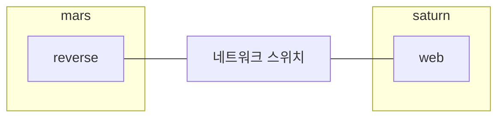
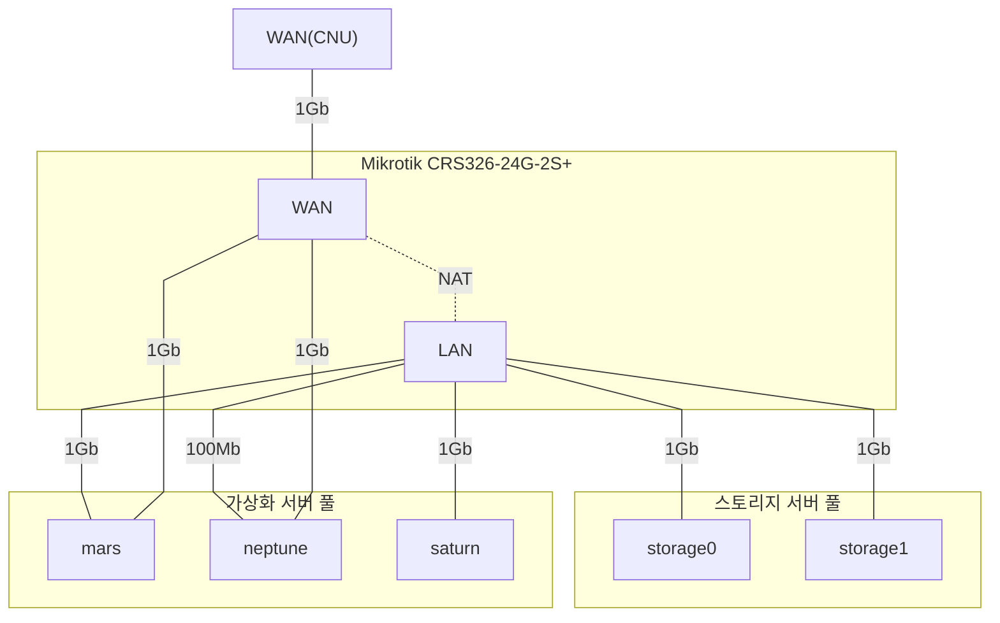
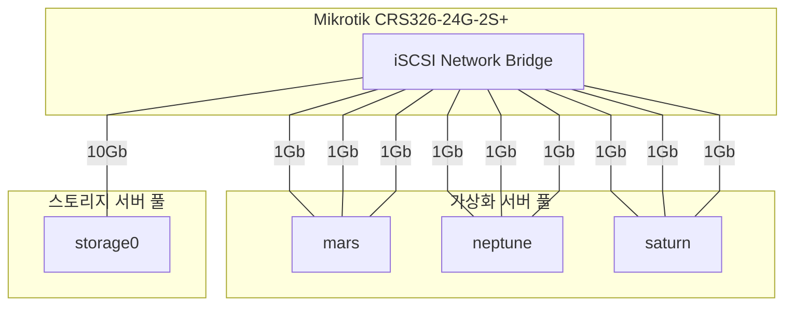
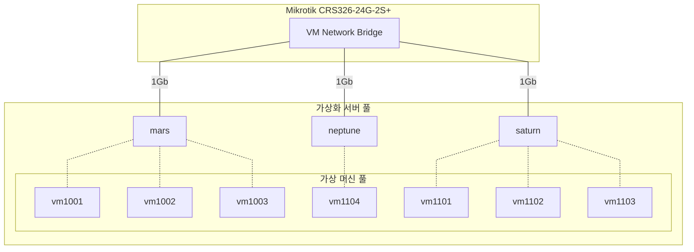
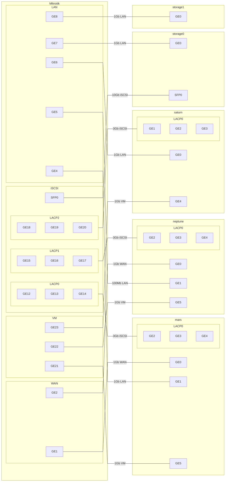

## 현재 상태

아르고스 동아리 방에는 여러 대의 컴퓨터가 24/7으로 돌아가고 있다.

그 중 3대는 [Proxmox VE](https://www.proxmox.com/en/proxmox-ve)라는 OS가 돌아가고 있는데, 이는 동아리 내부 IT 서비스를 제공하기 위한 가상화 서버로 이용되고 있다.

### 구성도

아르고스 네트워크 구조

스토리지 서버 네트워크

가상화 현황

### 문제점

#### 네트워크 망 분리

가상화 서버 및 스토리지 서버 모두 라우터의 내부 망(10.0.0.0/8)에 연결되어 있다.

내부 가상 머신 간에 통신을 위해서는 **서로 같은 네트워크**로 연결되어 있어야 한다.

하지만 서버에 설치되어 있는 네트워크 어댑터가 한정되어 있어, 같은 라우터 망을 다른 IPv4 대역으로 변경하여 사용 중에 있다.

이로 인해 가상 머신이 스토리지 서버에 접속할 수 있는 문제가 발생했다.

#### iSCSI 서버 처리 지연율

메인 스토리지 서버(iSCSI)와 가상화 서버 풀 간의 연결은 하나의 1Gb 링크로 연결되어 있다.

1Gb의 대역폭은 현재 iSCSI의 처리 능력(I/O Throughput)을 감안해도, 세 대의 가상화 서버가 사용하기에는 무리가 있다.

또한, 서버 간에 사용량에 대한 조율이 되는 것 또한 아니기 때문에, 하나의 서버가 iSCSI의 이용을 최대로 점유할 경우 다른 서버에서 작동 중인 가상 머신들은 영향을 받을 수 밖에 없다.

## 구상중인 네트워크

### 구상도

네트워크 구성도 (인터넷, 관리 네트워크)

네트워크 구성도 (iSCSI)

네트워크 구성도 (VM)

라우터 포트 연결도

### 기대되는 효과

1. 관리 망과 iSCSI, VM 망의 분리로 네트워크 보안 강화
2. iSCSI 리소스 접근 지연율 감소

### 필요 자원

- 10Gbps 네트워크 카드 x1
- 1Gbps 4포트 네트워크 카드 x3
